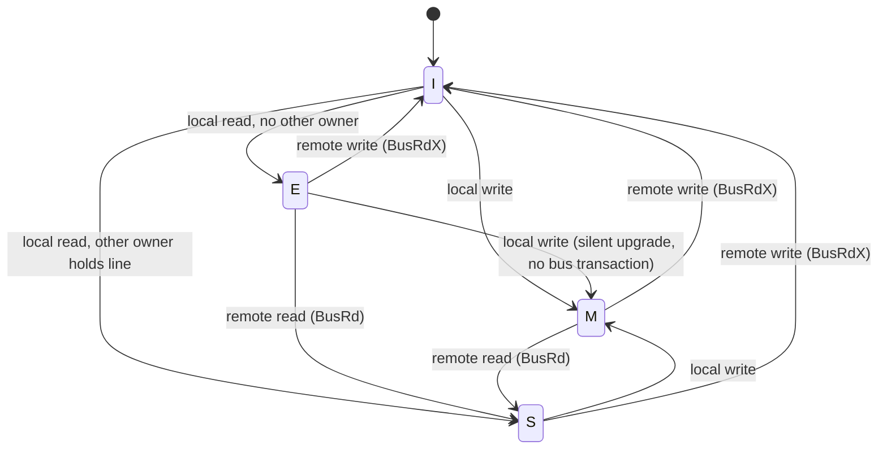

# MESI Cache Coherence Protocol: Formal Verification

Formal verification of a MESI snooping cache coherence protocol using SystemVerilog Assertions
(SVA) and SymbiYosys. The model covers three caches sharing one cache line over a single snooping
bus, proving the core coherence invariants: mutual exclusion of the Modified state, no stale data
after invalidation, and correct state transitions on every local and remote bus event.

This kind of protocol correctness problem, exhaustively checking every reachable interleaving of
concurrent reads and writes across multiple caches, is a natural fit for formal verification rather
than simulation. A directed testbench can only exercise the interleavings someone thought to write;
model checking proves the invariant holds for every reachable state.

## Result summary

- **25 of 25 safety and functional-correctness properties proven** by k-induction (unbounded proof,
  not a bounded sample)
- **9 of 9 coverage goals reached** (19 individual witnesses across the cache instances and
  cross-cache scenarios)
- Headline ownership-transfer scenario, and separately the full Invalid to Exclusive to Modified
  lattice, independently confirmed from the raw waveform in GTKWave, not only the solver's summary
  label

## What is verified

- **Mutual exclusion of Modified.** At most one cache holds a line in the Modified state at any
  time.
- **Single-writer invariant.** If a cache holds Exclusive or Modified (write permission), no other
  cache holds any copy of that line. This is the general property that forbids the classic
  coherence bug of one cache being Modified while another is stale-Shared, and it subsumes mutual
  exclusion of Modified as a special case.
- **No stale data after invalidation.** A remote write invalidates every other cache holding the
  line unconditionally.
- **Correct read-miss classification.** A read miss becomes Exclusive when no other cache holds the
  line, and Shared when one does.
- **Silent upgrade optimization.** A write to an already-Exclusive line upgrades to Modified without
  issuing a bus transaction, the write-performance optimization real MESI implementations rely on.
- **Reachability of every state and the full ownership-transfer transaction**, where one cache's
  Modified line downgrades to Shared in the same cycle another cache's read pulls it to Shared too.

See [docs/verification_plan.md](docs/verification_plan.md) for the full property list, environment
assumptions, traceability matrix, and sign-off criteria.

## Repository layout

```
rtl/
  mesi_line.v          single cache-line MESI controller (reference model)
  mesi_cache_core.v     per-cache MESI core used by the multi-cache model
  mesi_multi_cache.v    top-level: N caches sharing one line over one snooping bus, with
                         all SVA properties, assumptions, and cover statements
formal/
  mesi_line.sby              proof run for the single-cache reference model
  mesi_line_cover.sby        coverage run for the single-cache reference model
  mesi_multi_cache.sby       proof run for the multi-cache model (25 properties)
  mesi_multi_cache_cover.sby coverage run for the multi-cache model (8 goals)
docs/
  verification_plan.md  full verification plan: properties, assumptions, traceability, sign-off
```

## Design

MESI states are encoded as a 2-bit value: Invalid, Shared, Exclusive, Modified. Each cache
instance receives a local CPU read/write request and a bus snoop (BusRd or BusRdX) from other
caches, and decides its next state with snoops taking priority over local requests in the same
cycle. The multi-cache top level wires N cache instances together over a shared bus: whichever
cache is granted the bus in a given cycle broadcasts any bus transaction its request implies, and
every other cache observes that transaction as a snoop the same cycle.



The model deliberately covers one cache line, not a full multi-line cache with tags, addresses, and
a replacement policy. Coherence correctness is a per-line property; the invariants proved here must
independently hold for every line in a real cache. Modeling one line proves the protocol logic
without the address-space state-space blowup that would add nothing to this question.

## Tool chain

- [Yosys](https://github.com/YosysHQ/yosys), SystemVerilog frontend
- [SymbiYosys](https://github.com/YosysHQ/sby), BMC and k-induction via the `smtbmc` engine
- [GTKWave](https://gtkwave.sourceforge.net/), waveform inspection of counterexample and cover
  traces

## Reproducing the results

```
cd formal
sby -f mesi_multi_cache.sby        # 25 safety/correctness properties, proven by k-induction
sby -f mesi_multi_cache_cover.sby  # 8 coverage goals, all reached
sby -f mesi_line.sby               # single-cache reference model, proven
sby -f mesi_line_cover.sby         # single-cache reference model, coverage
```

Each run reports a pass/fail status per property and, for a cover run, writes a `.vcd` trace per
witness that can be opened directly in GTKWave.

## Notable findings during development

**An environment assumption was debugged with a real counterexample, not assumed on faith.** The
first version of the multi-cache bus assumption serialized every local request, one cache at a time,
system-wide. That is stronger than needed, so it was loosened to serialize only real bus
transactions, and the proof was re-run to check for over-constraint. It failed: with the loosened
assumption, a cache holding the line Exclusive can attempt a silent write to Modified in the same
cycle another cache independently misses and issues a real bus read. Reading the counterexample
trace showed the first cache's own FSM prioritizes the incoming snoop over its pending local write,
so it silently downgrades to Shared instead of reaching Modified, a lost write on a concurrent
access, and the same race recurs for a redundant write on an already-Modified line. Both are genuine
behavior of this stall-free design, not a modeling artifact. The assumption was tightened back to the
precise condition that actually matters (serializing real bus transactions together with silent
Exclusive/Modified writes, the two event classes shown to race) rather than reverting to the original
blanket form, and a new coverage goal confirms the narrower assumption still permits real concurrency
(two caches reading a line they already hold Shared in the same cycle). See section 3 of
[docs/verification_plan.md](docs/verification_plan.md) for the full trace analysis.

Two more real limitations, this time in this yosys build's SystemVerilog frontend, were found and
worked around while building this model, both confirmed with isolated single-purpose probes before
being treated as real limitations rather than a bug in this design:

- **Concurrent SVA is not accepted.** `assert property (@(posedge clk) ... |=> ...)` is valid IEEE
  1800 syntax, but this frontend rejects it outright with a parse error on the `@` token, even for
  a trivial standalone module. Every next-cycle property in this model uses an immediate assertion
  with `$past()` instead, which expresses the same claim with the same sampled-value semantics.
- **Static labels collide across `generate for` iterations.** A label used inside a `generate for`
  loop is treated as a flat cell name rather than scoped per instance, so the same label on every
  iteration fails to elaborate past the first one. Per-cache checks are left unlabeled as a result;
  SymbiYosys still reports the exact failing cache instance through its hierarchical path in any
  counterexample.

## License

MIT. See [LICENSE](LICENSE).
